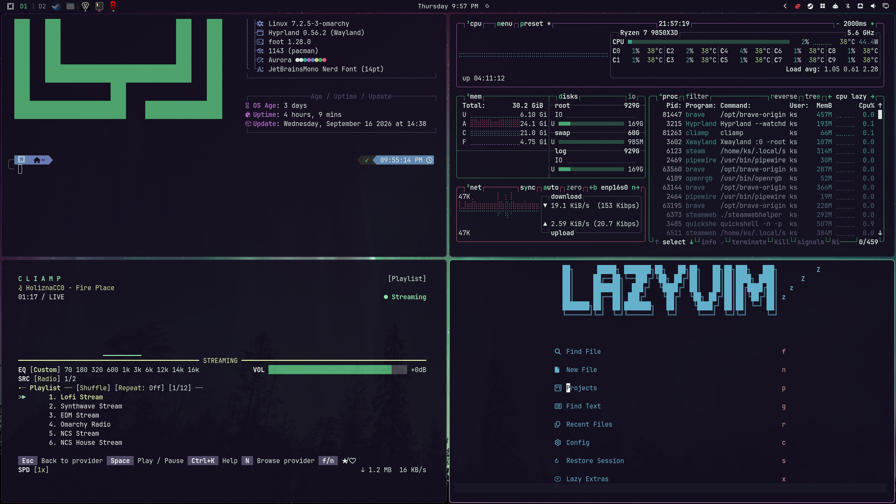
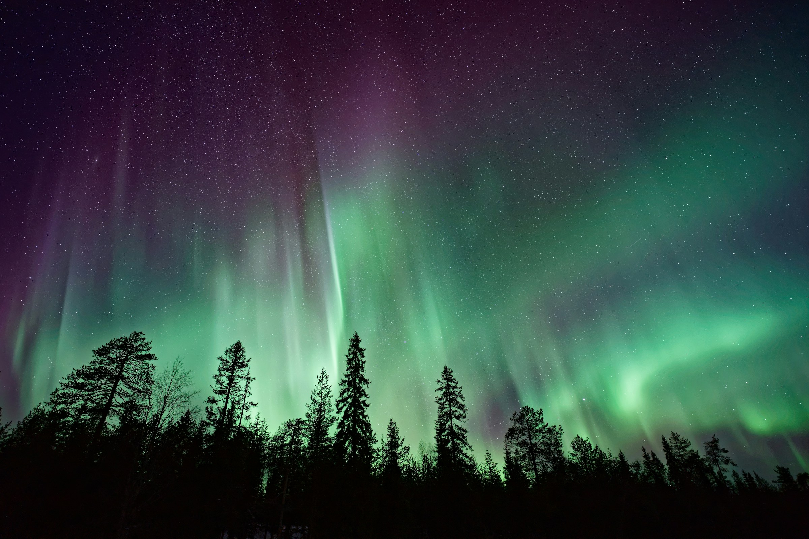
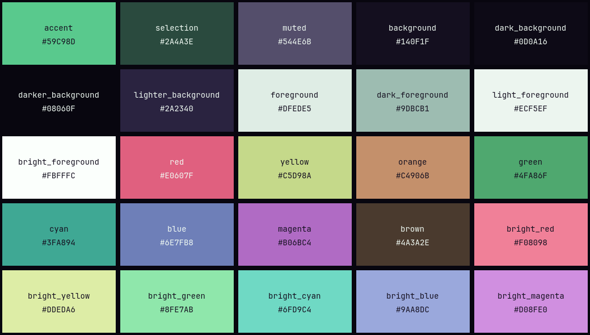

# Aurora

A dark [Omarchy](https://omarchy.org) theme drawn from a photo of the northern lights over a pine forest: a violet night sky, green and teal aurora, and pale starlight text.








## Install

```bash
omarchy theme install https://github.com/thevideinfra/omarchy-aurora-theme
```

Or open **Install > Style > Theme** in the Omarchy menu and paste the URL.

## Palette

| Role | Color |
|------|-------|
| Background | `#140F1F` |
| Foreground | `#DFEDE5` |
| Accent | `#59C98D` |
| Selection | `#2A4A3E` |

Three wallpapers ship in `backgrounds/`: the aurora photo, the Omarchy logo in the accent green, and the logo in a stepped gradient that runs through the palette from magenta to bright green. Cycle between them with `omarchy theme bg next`.

Window borders use a green-to-violet gradient (`#59C98D` to `#B06BC4`). Terminal, editor and app colors are generated from `colors.toml`, so every app Omarchy themes picks up the palette.

## Credits

Wallpaper: [Polar lights over dark trees](https://unsplash.com/photos/silhouette-of-trees-near-aurora-borealis-at-night-62V7ntlKgL8) by [Vincent Guth](https://unsplash.com/@vingtcent), used under the [Unsplash License](https://unsplash.com/license).

## License

The theme files are released under the MIT License. See [LICENSE](LICENSE). The wallpaper in `backgrounds/` is not covered by that license; it stays under the Unsplash License.
